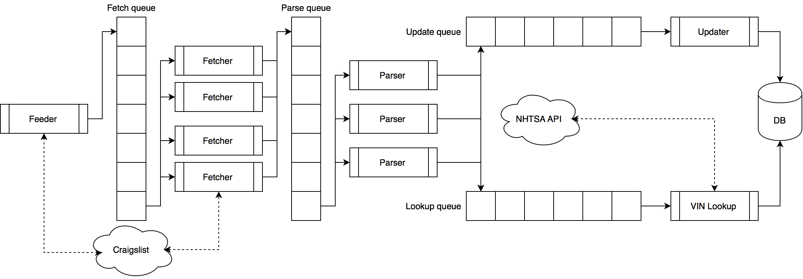

# Octopost
*A Multithreaded Craigslist used car ad crawler to rule them all*

Octopost is a web crawler designed to
  * Retrieve all used car ads on every of the 420 Craigslist sites in the USA
  * Parse ads to find features such as make, model, price, mileage, and many more
  * Save useful features to a centralized database
  
Octopost is most useful when used with its companion webapp https://github.com/julien-piet/car_analytics
 
## Design

Octopost makes use of the Threading API in python to make use of down time during a request.
It has a parallel queue architecture to pipeline the loading process. Furthermore, Octopost uses the NHTSA API at https://vpic.nhtsa.dot.gov/api/ to get detailed information on specific models to complete the data pulled from craigslist

### Structure 

There are 5 types of threads in Octopost

* Feeder : This thread loads a list of every Craigslist site URL, then puts newly posted ads urls in the fetch queue
* Fetcher : This thread pops items from the fetch queue and loads the HTML page, then saves it to the parse queue
* Parser : The parser analyses the content of the ad webpage to get the car features, then saves the information to the update queue. If a VIN is provided, the parser will add it to the lookup queue in order to get more precise details about the vehicle from the NHTSA - the National Highway Traffic Safety Administration.
* Updater : The updater takes ad data from the parser, and saves it to the centralized database.
* Lookup : The lookup thread takes a list of VINs extracted from ads and gets more details about the model, trim and series of the vehicle. It then saves this information to the database. 

The following is a diagram of the program :

### Specifications 

#### Feeder

The feeder keeps a local list of visited webpages to avoid loading the same ad multiple times. Once it went through the list of all Craigslist sites, it will start again to load fresh ads.

#### Fetcher

The fetcher loads individual used car postings. It does not parse anything, but only uses the BeautifulSoup python module to have getters for the different HTML tags on the page

#### Parser

The parser uses an extraction module that fetches the following features from the body of the posting : 

| Feature       | Data type     | Example value  |
| ------------- |:-------------:| --------------:|
| Ad title      | Text          | "Car for sale" |
| Make          | Text          |"Mercedes-Benz" |
| Model         | Text          |    "S Class"   |
| Trim          | Text          |    "W 140"     |
| Series        | Text          |    "S 420"     |
| Mileage       | Integer       |     145000     |
| Year          | Integer       |      1999      |
| Price         | Integer       |      4000      |
| Url           | Text          | "http://..."   |
| VIN           | Text          | WDBGA43G2XA424858|
| post_date     | Date          |  01/08/2019    |
| update        | Date          |  15/08/2019    |
| car title     | Text          |  "Clean"       |
| car condition | Text          | "Good"         |
| car type      | Text          |  "Full size"   |
| color         | Text          | "White"        |
| geolocation   | Geography     | ...            |

Most of these are identified using a regular expression, but in some cases it can be trickier. 
The model, series and trim for instant are not always clearly identified. If a VIN is given, a lookup on the NHTSA website will give you that information, but if no VIN is probided, the Parser takes a list of possible models, series and trims that came up in previous VIN lookups, and tries to find the best match.

The Parser also does some cleaning : if an ad doesn't have a sufficient number of features, it discards the ad to avoid polluting the database.

#### Updater

The Updater takes care of all database writing. It pops new database entries from the queue and writes them to memory. To increase speed, the writes are done in bulk : the updater pops lists of 25 new entries at a time to write them all to memory at once.

This is also where we take care of syncing the database. At fixed intervals, the updater will move old ads to the archive, get a fresh list of possible models, trims and series for the parser, and update new ads with the result from the VIN lookup.

#### Lookup

As for the updater, the lookup thread uses bulk calls to the NHTSA API in order to speed up the process. The structure of a **V**ehicle **I**dentification **N**umber is decripted here[https://en.wikipedia.org/wiki/Vehicle_identification_number]. VINs have 17 digits, the first 9 identify a unique model of a car, while the last 8 identify the specific car. This means that we only have to compare the first 9 digits of VINs in order to fully determine the model, series and trim. 

### Database

There are three important tables in the database
* **Ads** : Contains all non-expired posts
* **Vins** : Contains the make and model information for every unique sequence of the first 9 digits of the VINs we encounter in posts.
* **Models** : Contains a list of possible models that is derived from the VINs table.

## Usage

Run `python master.py`

Once the interpreter starts, type `help` to see your options

## Setup

To install on your local machine :

1. Setup python virtual env
`virtualenv -p python3 venv`

2. Install pip dependencies 
`pip install -r requirements.txt`

3. Install postgresql from https://www.postgresql.org/download/

4. Install postGIS from https://postgis.net

5. Create database 
`create_db [database_name]`

6. Activate postGIS in that database by running `CREATE EXTENSION postgis;` after you connect with `psql [database_name]`

7. Unzip database dump
`tar xvf db_dump.tar`

8. Install database
`pg_restore -d [database_name] db_dump_file`

9. Update database.ini with your database credentials

10. Run 
`python master.py`

## Disclaimer

This software under the GPL3 license, check the license file for more info. It is in no means intended to be used in a professional setting. It might (and probably does) have bugs. Use with care. 
